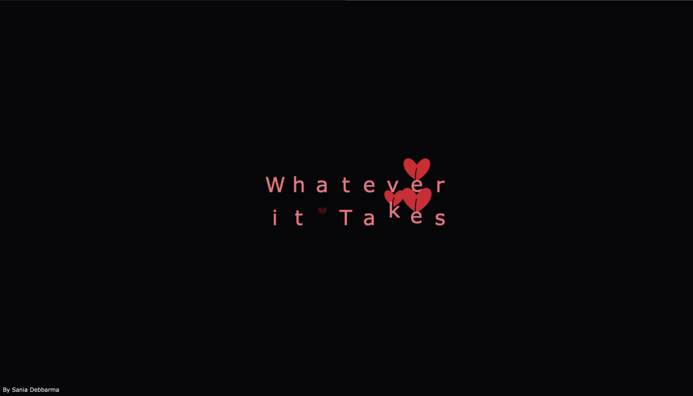
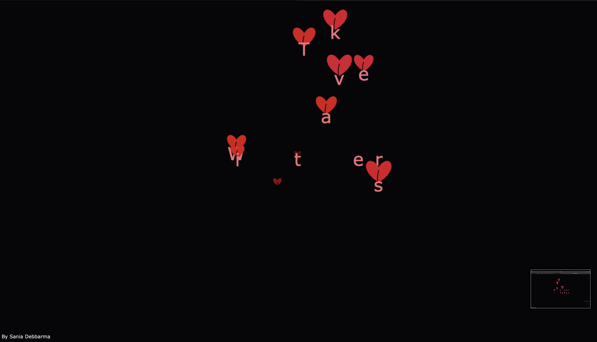

# heart-baloons
Heart Balloon &amp; Fireworks Animation An HTML5 Canvas animation that displays the message “Happy Life” with colorful, sparkling firework trails and floating heart-shaped red balloons tied with black ribbons
# 🎇 Whatever it Takes — Heart Balloons & Sparkling Fireworks

An HTML5 Canvas animation that brings the motivational phrase **"Whatever it Takes"** to life with:

- 🎆 **Sparkling fireworks trails** that launch each letter into the air
- ❤️ **Heart-shaped red balloons** tied with black curly ribbons
- ✨ **Glowing effects** and smooth floating animations
- 🔄 A continuous loop for a never-ending celebration

---

## 📸 Preview





---

## ✨ Features
- Pure **HTML5, CSS, and JavaScript** — no frameworks needed
- Responsive — adapts to any screen size
- Eye-catching **fireworks with sparkle particles**
- Floating **heart-shaped red balloons** with realistic ribbons
- Motivational phrase *"Whatever it Takes"* in glowing style

---

## 🚀 How to Use
1. **Clone or download** this repository.
2. Open the `index.html` file in your browser:
   ```bash
   open index.html
   3.	Enjoy the animation!

⸻

🎯 Customization

You can easily change:
	•	Text → edit opts.strings in the script
	•	Colors → modify balloon, ribbon, and firework colors
	•	Speeds & sizes → adjust firework and balloon parameters
	•	Sparkle density → tweak sparkleChance and sparkleMaxSize

⸻

🛠️ How It Works
	•	Each letter goes through 3 phases:
	1.	Firework Phase — launches upward with a sparkling trail
	2.	Contemplate Phase — letter appears glowing with an explosion of shards
	3.	Balloon Phase — heart balloon inflates and floats the letter away
	•	Animation loops endlessly for continuous celebration.

⸻

📄 License

This project is licensed under the MIT License — free to use, modify, and share.

